# API TESTING

## Day1 : Concpets

1. What is Client & Server?
2. What is API?
3. What are the types of API?
4. REST API HTTP Methods
5. HTTP vs HTTPS
6. Terminologies

## What is Client and Server?
### Client: 
A computer where you are trying to access the application. EX: Browser
### Server:
from where application is installed and from where you are able to exactly accessing
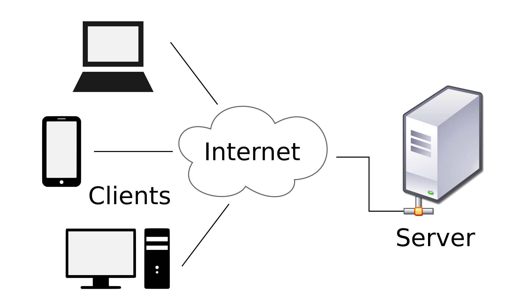

# Client-Server Architecture

Client – is a computer/machine/device which sends request to a server. Now, the question will be coming to your mind what is a request? What type of request it is? What is a server?

Request – is in the form of HTTP request. HTTP is a type of protocol which is used to communicate between a client and a server. HTTP stands for Hypertext transfer protocol.

Server – is a computer/device/machine which accepts the HTTP request sent by client and send response back to client in the form of HTTP.

## Types of Client-Server Architecture

### 1 Tier Architecture
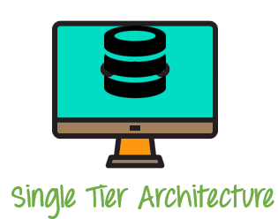

1 tier architecture –>where Data and Application resides in one machine. Presentation, Business, Data Access layers within a single software package. The data is usually stored in the local system or a shared drive. Application such as MS Office come under one-tier application.

### 2 Tier Architecture
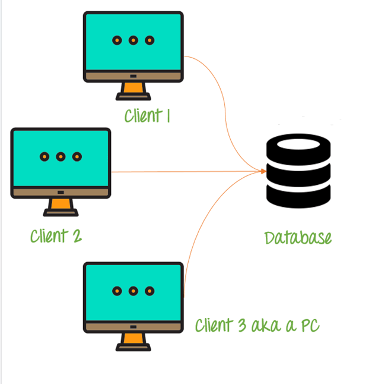

2 tier architecture –>where Client resides at one system and database server is at another system. We can have multiple clients. For instance, online ticket reservations software use the two-tier architecture.

### 3 Tier Architecture
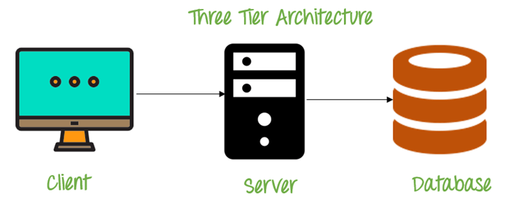

3 tier architecture--> In 3 tier architecture, we need Internet. This is applicable mainly for web applications. We have client (Browser), DB server (where we store our data). In between client and server, there is business logic layer (which is called as middle layer).

#### 3 Layers here:
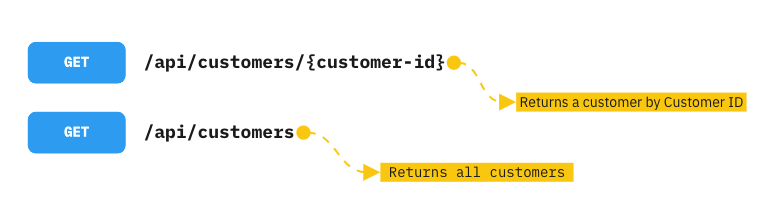
1. Client layer/Client Server/Presentation Layer/UI
2. Business Logic Layer/Application layer/Application server/Web server
3. Database Layer/Database server

#### Technologies:

We have different technologies to design all the different layers in 3 tier architecture.

For **Presentation Layer** – we use scripting languages example: HTML5, JavaScript and CSS

For **Business Layer** – As we will apply logic implementation here so we will use programming languages to code. Example: Java, C#, .NET, Python. Business/application layer is the CORE component in 3 tier architecture.

For **Data Layer** – Oracle, SQL Server, My SQL, MongoDB and many more

Testing done on presentation layer is called **GUI testing**. Manual testing or automation testing comes under this layer. Example: We use Selenium ( or such tools) to test this layer.

Testing done on Business logic layer is called **API testing**. When we directly provide some inputs and verify the output, is called API testing. API testing happens at Business layer or the Application layer. In API testing, we provide some request and get response. Agree?

Testing done on database layer is called **Database testing**.

## What is API?
**Application programming Interface:** It is a way of communicating between two applications where applications may differ in their platforms or in terms of technology.


Exmaple: 
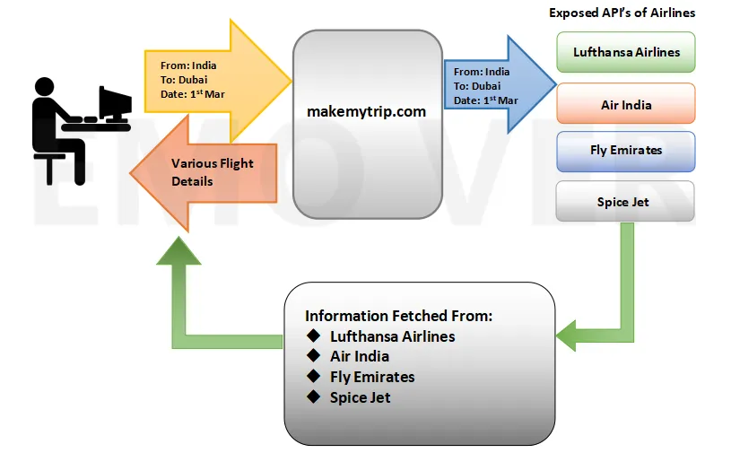

## Types of APIs
#### 1. SOAP : Simple Object Access Protocol 
 (Old; supports only xml format, and xml file are larger)
#### 2. REST : Representational State Transfer 
 (Latest; supports xml, json etc)

#### SOAP and REST both are web servcies

### Difference between API and WEB services?
 > 1. Web services is an API wrapped in HTTP.
 > 2. All Web services are APIs , All APIs are not web services.
 > 3. A web services needs a network while a API doesn't need a network for it's opertions.

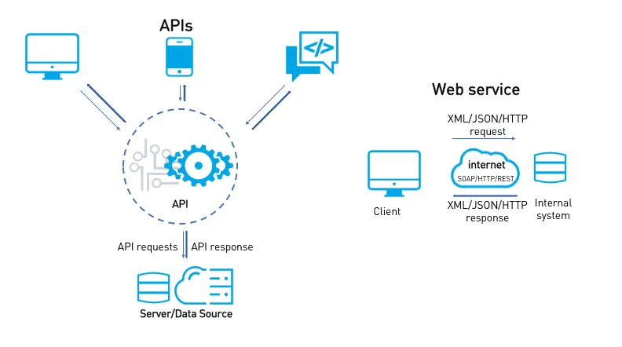

##### API >> devloped and testing before moving to production/web environment/Public.
##### Web Services >> API which is devloped and tested then moved to Internet/production/web environment/Public is called as Web services.

## REST API HTTP METHODS
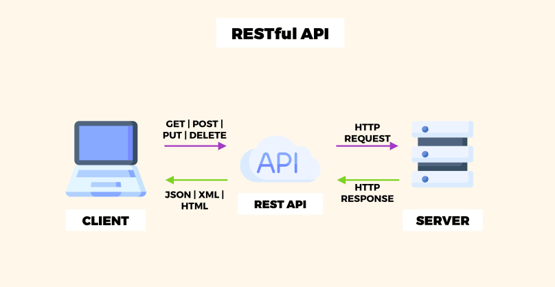

REST API Methods: CRUD opertions
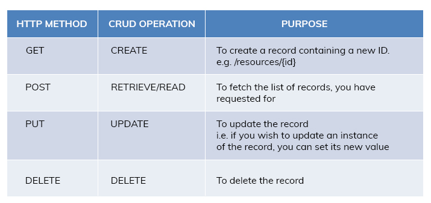

## HTTP vs HTTPS protocal

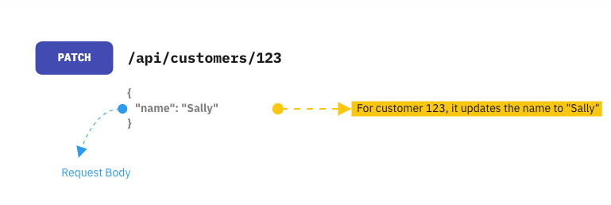

### Terminologies:
```console
URI : Uniform Resource Indentifier
URL : Uniform Resource Locator
URN : Uniform Resource Name
```

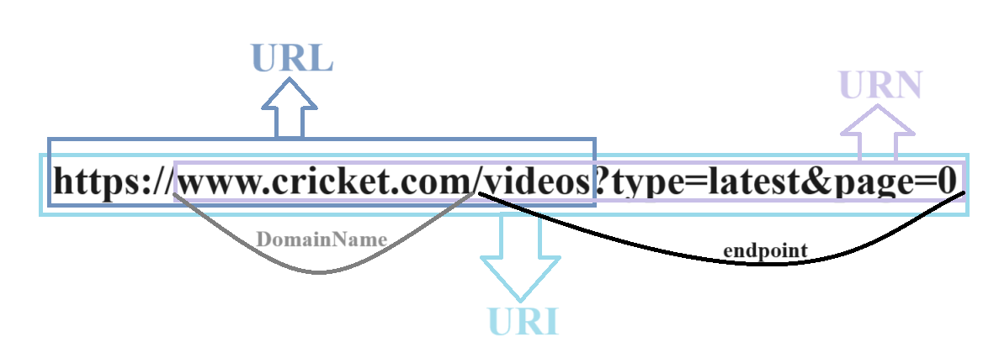

Feature and Resource
**Feature:** Term used in manual testing to test some functionality.
**Resource:** Term used in API Automation testing to testing referring to some functionality.

**Payload**: Body in the HTTP request and Response Message.

1. Request Payload:  data given while resquesting (body> PUT, POST)
2. Response Payload: data recevied as response for the request(body>json)

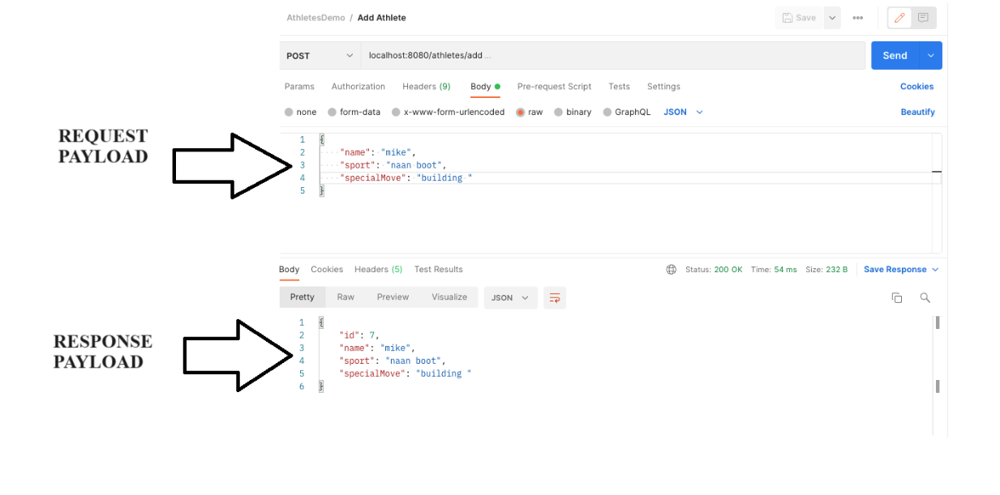

# Day 2
Concpets:
1. About Postman
2. GET HTTP Request
3. POST HTTP Request
4. PUT HTTP Request
5. DELETE HTTP Request
6. Status Code and 3 levels


# POSTMAN: API Testing tool
Postman is an API(application programming interface) development tool which **helps to build, test and modify APIs.**

Postman can be used through website or application.

Postman website


