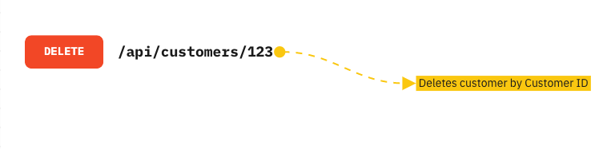

# API TESTING

## Day1 : Concpets

1. What is Client & Server?
2. What is API?
3. What are the types of API?
4. REST API HTTP Methods
5. HTTP vs HTTPS
6. Terminologies

## What is Client and Server?
### Client: 
A computer where you are trying to access the application. EX: Browser
### Server:
from where application is installed and from where you are able to exactly accessing


# Client-Server Architecture

Client – is a computer/machine/device which sends request to a server. Now, the question will be coming to your mind what is a request? What type of request it is? What is a server?

Request – is in the form of HTTP request. HTTP is a type of protocol which is used to communicate between a client and a server. HTTP stands for Hypertext transfer protocol.

Server – is a computer/device/machine which accepts the HTTP request sent by client and send response back to client in the form of HTTP.

## Types of Client-Server Architecture

### 1 Tier Architecture


1 tier architecture –>where Data and Application resides in one machine. Presentation, Business, Data Access layers within a single software package. The data is usually stored in the local system or a shared drive. Application such as MS Office come under one-tier application.

### 2 Tier Architecture


2 tier architecture –>where Client resides at one system and database server is at another system. We can have multiple clients. For instance, online ticket reservations software use the two-tier architecture.

### 3 Tier Architecture


3 tier architecture--> In 3 tier architecture, we need Internet. This is applicable mainly for web applications. We have client (Browser), DB server (where we store our data). In between client and server, there is business logic layer (which is called as middle layer).

#### 3 Layers here:

1. Client layer/Client Server/Presentation Layer/UI
2. Business Logic Layer/Application layer/Application server/Web server
3. Database Layer/Database server

#### Technologies:

We have different technologies to design all the different layers in 3 tier architecture.

For **Presentation Layer** – we use scripting languages example: HTML5, JavaScript and CSS

For **Business Layer** – As we will apply logic implementation here so we will use programming languages to code. Example: Java, C#, .NET, Python. Business/application layer is the CORE component in 3 tier architecture.

For **Data Layer** – Oracle, SQL Server, My SQL, MongoDB and many more

Testing done on presentation layer is called **GUI testing**. Manual testing or automation testing comes under this layer. Example: We use Selenium ( or such tools) to test this layer.

Testing done on Business logic layer is called **API testing**. When we directly provide some inputs and verify the output, is called API testing. API testing happens at Business layer or the Application layer. In API testing, we provide some request and get response. Agree?

Testing done on database layer is called **Database testing**.

## What is API?
**Application programming Interface:** It is a way of communicating between two applications where applications may differ in their platforms or in terms of technology.


Exmaple: 


## Types of APIs
#### 1. SOAP : Simple Object Access Protocol 
 (Old; supports only xml format, and xml file are larger)
#### 2. REST : Representational State Transfer 
 (Latest; supports xml, json etc)

#### SOAP and REST both are web servcies

### Difference between API and WEB services?
 > 1. Web services is an API wrapped in HTTP.
 > 2. All Web services are APIs , All APIs are not web services.
 > 3. A web services needs a network while a API doesn't need a network for it's opertions.


##### API >> devloped and testing before moving to production/web environment/Public.
##### Web Services >> API which is devloped and tested then moved to Internet/production/web environment/Public is called as Web services.

## REST API HTTP METHODS


REST API Methods: CRUD opertions


## HTTP vs HTTPS protocal


### Terminologies:
```console
URI : Uniform Resource Indentifier
URL : Uniform Resource Locator
URN : Uniform Resource Name
```


Feature and Resource
**Feature:** Term used in manual testing to test some functionality.
**Resource:** Term used in API Automation testing to testing referring to some functionality.

**Payload**: Body in the HTTP request and Response Message.

1. Request Payload:  data given while resquesting (body> PUT, POST)
2. Response Payload: data recevied as response for the request(body>json)


# Day 2
Concpets:
1. About Postman
2. GET HTTP Request
3. POST HTTP Request
4. PUT HTTP Request
5. DELETE HTTP Request
6. Status Code and 3 levels


# POSTMAN: API Testing tool
Postman is an API(application programming interface) development tool which **helps to build, test and modify APIs.**

Postman can be used through website or application.

Postman website

How to use postman to test api:
1. Create a workspace, workspace: area where we maintain and save files.
2. Create a collection, conatins number of folders and HTTP requests.
operations can be performed in a collection: create, rename, delete and run collection
we can create n number of collections under a workspace.


Validation is done with the Response provided by the API

Types of requests can be created under collection:
 ```
 GET -> Retrieving a single or multiple resources.
 POST -> Creating a new resource.
 PATCH -> Updating a resource.
 PUT -> Updating resource if exists / Creating new resource if it doesn't exist.
 DELETE -> Destroying a resource.
 ```

## GET Method
If we want to retrieve data from a resource like websites, servers or APIs, we send them a GET Request. For example, we send a GET request to the server if we want a list of our customers or a specific customer.

Example of HTTP GET request


Since the GET method should never change the data on the resources and just read them(read-only), it is considered a Safe Method. Additionally, the Get method is idempotent.

### How to test an API with a GET method?
When we want to test an API, the most popular method that we would use is the GET method. Therefore, We expect the following to happen.

> If the resource is accessible, the API returns the 200 Status Code, which means OK.
Along with the 200 Status Code, the server usually returns a response body in XML or JSON format. So, for example, we expect the [GET] /members endpoint to return a list of members in XML or JSON.

> If the server does not support the endpoint, the server returns the 404 Status Code, which means Not Found.

> If we send the request in the wrong syntax, the server returns the 400 Status Code, which means Bad Request.

## POST Method
The POST method creates a new resource on the backend (server). The request body carries the data we want to the server. It is neither a safe nor idempotent method. We don’t expect to get the same result every time we send a POST request. For example, two identical POST requests will create two new equivalent resources with the same data and different resource ids.

When sending a POST request to a server, we expect the following to happen:

> Ideally, if the POST request has created a new resource on the other side, the response should come with 201 Status Code which means Created.

> Sometimes, performing a POST request doesn’t return a resource at the given URL; in this case, the method will return 204 status code which means No content.

Example of HTTP POST request


### How to test a POST endpoint
Since the POST method creates data, we must be cautious about changing data; testing all the POST methods in APIs is highly recommended. Moreover, make sure to delete the created resource once your testing is finished.

Here are some suggestions that we can do for testing APIs with POST methods:

> Create a resource with the POST method, and it should return the 201 Status Code.

> Perform the GET method to check if it created the resource was successfully created. You should get the 200 status code, and the response should contain the created resource.

> Perform the POST method with incorrect or wrong formatted data to check if the operation fails.

## PUT Method
With the PUT request method, we can update an existing resource by sending the updated data as the content of the request body to the server. The PUT method updates a resource by replacing its entire content completely. If it applies to a collection of resources, it replaces the whole collection, so be careful using it. The server will return the 200 or 204 status codes after the existing resource is updated successfully.

Example of HTTP PUT request


### How to test an API with a PUT method?
The PUT method is idempotent, and it modifies the entire resources, so to test that behavior, we make sure to do the following operations:

> Send a PUT request to the server many times, and it should always return the same result.
When the server completes the PUT request and updates the resource, the response should come with 200 or 204 status codes.

> After the server completes the PUT request, make a GET request to check if the data is updated correctly on the resource.

>If the input is invalid or has the wrong format, the resource must not be updated.

## PATCH Method
PATCH is another HTTP method that is not commonly used. Similar to PUT, PATCH updates a resource, but it updates data partially and not entirely. For example, to make it more precise, the request [PUT] customers/{customerid} would update the fields in the Customers entity on the resource entirely. However, the PATCH method does update the provided fields of the customer entity. In general, this modification should be in a standard format like JSON or XML.

Example of HTTP PATCH request


### How to test an API with a PATCH method?
To test an API with the PATCH method, follow the steps discussed in this article for the testing API with the PUT and the POST methods. Consider the following results:

> Send a PATCH request to the server; the server will return the 2xx HTTP status code, which means: the request is successfully received, understood, and accepted.

> Perform the GET request and verify that the content is updated correctly.

> If the request payload is incorrect or ill-formatted, the operation must fail.

## DELETE Method
As the name suggests, the DELETE method deletes a resource. The DELETE method is idempotent; regardless of the number of calls, it returns the same result.

Most APIs always return the 200 status code even if we try to delete a deleted resource but in some APIs, If the target data no longer exists, the method call would return a 404 status code.

Example of HTTP DELETE request


### How to test a DELETE endpoint?
When it comes to deleting something on the server, we should be cautious. We are deleting data, and it is critical. First, make sure that deleting data is acceptable, then perform the following actions.

> Call the POST method to create a new resource. Never test DELETE with actual Data. For example, first, create a new customer and then try to delete the customer you just created.

> Make the DELETE request for a specific resource. For example, the request [DELETE] /customers/ {customer-id} deletes a customer with thee specified customer Id.

> Call the GET method for the deleted customer, which should return 404, as the resource no longer exists.

Testfully’s Multi-step tests allow you to create resources on the fly and use them for testing DELETE endpoints.